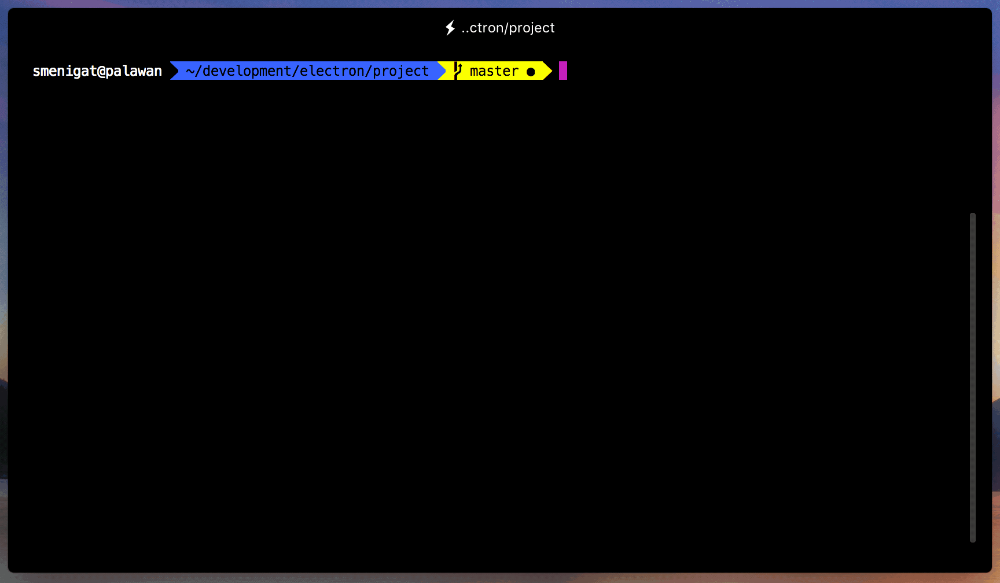

# electron-release-uploader

CLI tool to tar an electron build and upload it to an [electron-update-host](https://github.com/SMenigat/electron-update-host) instance.



## Installation

Install the package via npm:

```bash
# with npm
npm install --save-dev electron-release-uploader

# with yarn
yarn add --dev electron-release-uploader
```

## Integration

This is meant to seamlessly upload electron builds that have been created with `electron-builder -mwl` to an [electron-update-host](https://github.com/SMenigat/electron-update-host) instance from the command line.

Like you can see in the demo above, it might be usefull to create a `npm-script` to call the update CLI. The script that is shown in the video looks like this:

```json
{
  "scripts": {
    "upload-release": "node node_modules/electron-release-uploader/index.js",
  },
}
```

To configure the uploader, you have to add a `electronReleaseUploader` object to your projects `package.json`. Look at the following example:

```json
{
  "electronReleaseUploader": {
    "buildDir": "./dist",
    "uploadTargetUrl": "http://<your-update-server>/update/{version}",
    "passwordHeaderName": "X-Your-Password-Header"
  }
}
```

#### buildDir
Relative path from the project root to the output path of `electron-builder`.

#### uploadTargetUrl (optional)
URL of your electron-update-host instance. This should already point to the `/update/<version>` endpoint. 
The **{version}** tag will be replaced with your projects package version.

If you don't set this option, the uploader will try to upload the tar.

#### passwordHeaderName (optional)
Name of the password header field. The CLI will ask for your password if you set this option.